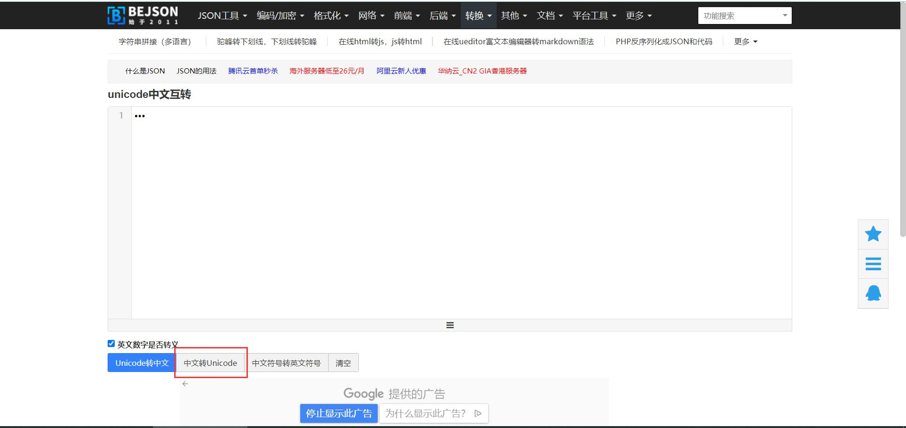
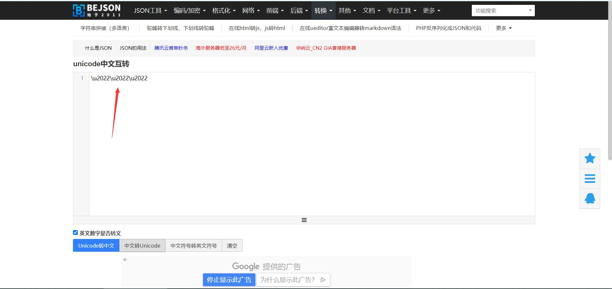

# 伪类元素的 content 值中含有中文时会出现乱码

## 问题描述

```css
.ele-pagination-jump-next::after {
  content: "•••"
}
```

如题所述，当伪类元素的 content 值中含有中文时偶尔会在浏览器中展示为乱码

 
## 处理方法

这个时候只需要将内容转换成 unicode 码就可以解决问题

首先百度一下 “中文转Unicode” 就可以找到很多网站，转换一下你的文字就可以了，我用的是这个 [中文转Unicode网站](https://www.bejson.com/convert/unicode_chinese/)



输入文字，点击正文的 “中文转Unicode” 按钮就可以得到结果



但是 css 中使用的 unicode 编码是不带 “u” 的需要把这些 “u” 去掉就可以了（具体为什么还没有弄明白，工作中碰到这个问题，等日后有时间再研究，先记录下来）

```css
.ele-pagination-jump-next::after {
  content: "\2022\2022\2022"
}
```