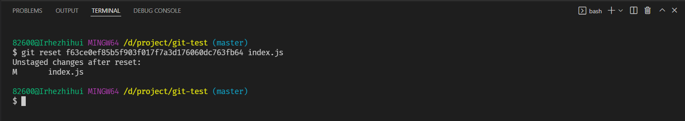
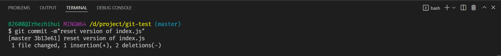
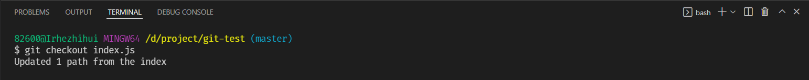

# 回退某个文件的版本

将某个文件的版本回退到指定版本，下文以回退**index.js**文件为例


## 首先查看 index.js 文件的提交历史记录

```bash
git log index.js
```

从输出的历史记录中获取到需要回退的版本的 **commit_id**


## 回退到指定的版本

```bash
git reset f63ce0ef85b5f903f017f7a3d176060dc763fb64 index.js
```




## 提交到本地

```bash
git commit -m"reset version of index.js"
```




## 更新到工作目录

```bash
git checkout index.js
```

