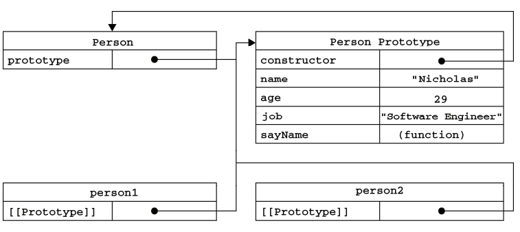

# 创建对象

## 组合使用构造函数模式和原型模式(**常用**)

```JavaScript
function Person(name, age, job) {
    this.name = name;
    this.age = age;
    this.job = job;
    this.friends = ["Shelby", "Court"];
}
Person.prototype = {
    constructor: Person,
    sayName: function () {
        alert(this.name);
    }
}
var person1 = new Person("Nicholas", 29, "Software Engineer");
var person2 = new Person("Greg", 27, "Doctor");
person1.friends.push("Van");
alert(person1.friends); //"Shelby,Count,Van" 
alert(person2.friends); //"Shelby,Count" 
alert(person1.friends === person2.friends); //false 
alert(person1.sayName === person2.sayName); //true
```

## 工厂模式

```JavaScript
function createPerson(name, age, job){ 
    var o = new Object();
    o.name = name; 
    o.age = age; 
    o.job = job;

    o.sayName = function(){ 
        alert(this.name); 
    }; 

    return o; 
}

var person1 = createPerson("Nicholas", 29, "Software Engineer"); 
var person2 = createPerson("Greg", 27, "Doctor");
```

## 构造函数模式

```JavaScript
function Person(name, age, job){ 
    this.name = name; 
    this.age = age; 
    this.job = job; 

    this.sayName = function(){ 
        alert(this.name);
    }; 
}

var person1 = new Person("Nicholas", 29, "Software Engineer"); 
var person2 = new Person("Greg", 27, "Doctor");
```

## 原型模式

```JavaScript
function Person(){} 
Person.prototype.name = "Nicholas"; 
Person.prototype.age = 29; 
Person.prototype.job = "Software Engineer"; 
Person.prototype.sayName = function(){ 
    alert(this.name); 
}; 

var person1 = new Person(); 
person1.sayName(); //"Nicholas" 

var person2 = new Person();
person2.sayName(); //"Nicholas" 
alert(person1.sayName == person2.sayName); //true
```

构造函数-原型-实例, 三者之间的关系图解(来自<<JavaScript高级程序设计（第3版）>>)



## 动态原型模式

```JavaScript
function Person(name, age, job) {
    //属性
    this.name = name;
    this.age = age;
    this.job = job;

    //方法
    if (typeof this.sayName != "function") {
        Person.prototype.sayName = function () {
            alert(this.name);
        };
    }
}

var friend = new Person("Nicholas", 29, "Software Engineer");
friend.sayName();
```

## 寄生构造函数模式

```JavaScript
function Person(name, age, job){ 
    var o = new Object(); 
    o.name = name; 
    o.age = age; 
    o.job = job; 
    o.sayName = function(){ 
        alert(this.name); 
    }; 
    return o; 
} 

var friend = new Person("Nicholas", 29, "Software Engineer"); 
friend.sayName(); //"Nicholas"
```

## 稳妥构造函数模式

```JavaScript
function Person(name, age, job){
    //创建要返回的对象
    var o = new Object(); 

    //可以在这里定义私有变量和函数
    //添加方法
    o.sayName = function(){ 
        alert(name); 
    }; 

    //返回对象
    return o; 
}

var friend = Person("Nicholas", 29, "Software Engineer"); 
friend.sayName(); //"Nicholas"
```
 
 