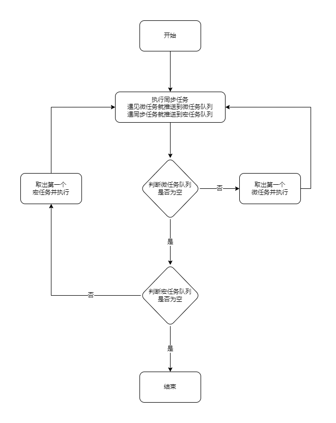

# 宏任务与微任务

## 运行机制

```
JS是单线程运行的, 所以同一时间只能执行一个任务

首先他会先执行完所有的同步任务

在执行同步任务的过程遇到宏任务就放到宏任务队列当中

遇到微任务就放到微任务队列当中

当执行完成所有的同步任务, 就执行所有的微任务, 再执行宏任务
```



## 宏任务(macro-task)

* setTimeout
* setInterval
* requestAnimationFrame
* setImmediate （IE及Node中有）

## 微任务(micro-task)

* promise.then
* promise.catch
* promise.finally
* MutationObserver