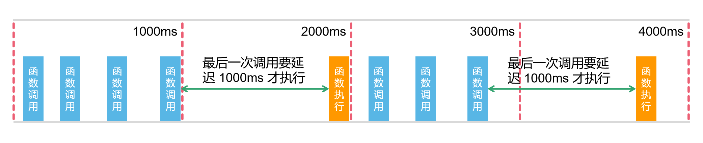
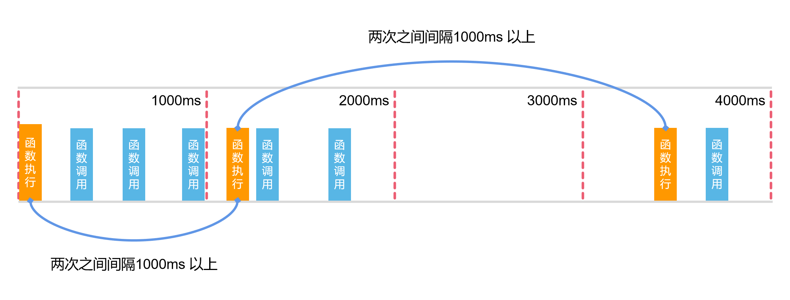

# 函数防抖与节流

https://mp.weixin.qq.com/s/Vkshf-nEDwo2ODUJhxgzVA

## 防抖

防抖: 多次调用函数，小于指定时间内，只执行最后一次调用

#### 应用场景

* 登录、发短信等按钮避免用户点击太快，以致于发送了多次请求
* 调整浏览器窗口大小时，resize 事件回调触发过于频繁
* input 框实时搜索并发送请求展示下拉列表，停止输入后一秒再发送请求
* 文本编辑器实时保存，当无任何更改操作一秒后进行保存



### 代码实现

```JavaScript
function debounce(fn, delay = 1000) {
    let timer = null;

    return function() {
        let context = this;
        let args = arguments;

        // 清除定时器
        timer && clearTimeout(timer);
        
        timer = setTimeout(function () {
            fn.apply(context, args);
        }, delay);
    }
}
```

## 节流

节流: 连续调用函数，会按指定的时间频率间隔调用函数

主要是用在一些需要持续调用函数的场景当中





### 应用场景

* 在 scroll 事件中，需要动态处理某些效果时
* input 框实时搜索并发送请求展示下拉列表，每隔一秒发送一次请求 (也可做防抖)

### 代码实现

```JavaScript
function throttle(fn, delay = 1000) {
    let lastTime = 0;           // 上次函数执行时所在的时间戳
    return function() {
        let now = Date.now();   // 获取函数当前执行的时间戳
        if(now - lastTime > delay) {
            lastTime = now;
            fn.apply(this, [...arguments]);
        }
    }
}
```