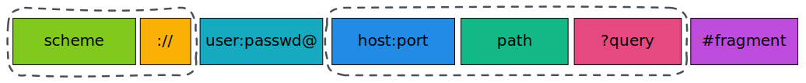

# 同源策略

##　URI

**URI**, 全称为(Uniform Resource Identifier), 也就是**统一资源标识符**，它的作用很简单，就是区分互联网上不同的资源。

但是，它并不是我们常说的`网址`, 网址指的是`URL`, 实际上`URI`包含了`URN`和`URL`两个部分，由于 URL 过于普及，就默认将 URI 视为 URL 了。

## URI 的结构

**scheme** 表示协议名，比如`http`, `https`, `file`等等。后面必须和`://`连在一起。

**user:passwd**@ 表示登录主机时的用户信息，不过很不安全，不推荐使用，也不常用。

**host:port** 表示主机名和端口。

**path** 表示请求路径，标记资源所在位置。

**query** 表示查询参数，为`key=val`这种形式，多个键值对之间用`&`隔开。

**fragment** 表示 URI 所定位的资源内的一个**锚点**，浏览器可以根据这个锚点跳转到对应的位置。

## 同源策略

浏览器遵循**同源政策**(`scheme(协议)`、`host(主机)`和`port(端口)`都相同则为`同源`)。

非同源站点有这样一些限制:

- 不能读取和修改对方的 DOM
- 不读访问对方的 Cookie、IndexDB 和 LocalStorage
- 限制 XMLHttpRequest 请求。

 