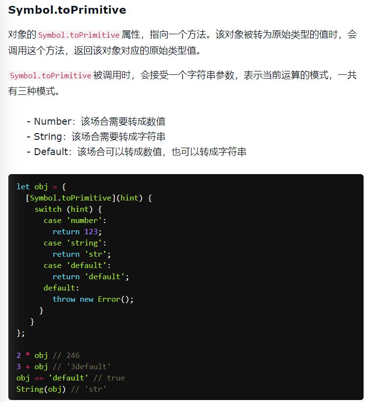

# JS 中的类型转换

## 引用类型转换为基本数据类型规则

1. 调用对象的 [[ToPrimitive]] 方法, 如果返回值是基本数据类型，就返回方法的返回值, 不是就执行下一步
2. 调用对象的 valueOf 方法，如果返回值是基础类型，就返回 valueOf 方法的返回值, 不是就执行下一步
3. 调用对象的 toString 方法，如果返回值是基础类型，就返回 toString 方法的返回值, 如果返回值不是基础类型就报错


```js
/* 例一 */
[] == false
// 这个地方就是按上方的规则调用，最后返回的是 toString() 的值 即 '' 空字符串
[][Symbol.toPrimitive]() || [].valueOf() || [].toString() == false
[].toString() == false
'' == false

/* 例二 */
[] + 2
[][Symbol.toPrimitive]() || [].valueOf() || [].toString() + 2
[].toString() + 2
// 因为数组
'' + 2
'2'

/* 例三 */
[] + {}
[][Symbol.toPrimitive]() || [].valueOf() || [].toString() + {}[Symbol.toPrimitive]() || {}.valueOf() || {}.toString()
[].toString() + {}.toString()
'' + '[Object Object]'
'[Object Object]'
```

### Symbol.toPrimitive 的更多细节


## 四则运算符的运算规则

- 若运算符为 + , 且运算中其中一方为字符串，那么就会把另一方也转换为字符串
- 如果一方不是字符串或者数字，那么会将它转换为数字或者字符串

```js
/* 例一 */
1 + true
1 + Number(true)
1 + 1
2

/* 例二 */
// 有 + 出现的时候，仅有一个操作项是字符串时，才会是字符连接操作
'' + true
'' + String(true) // 不确定是不是这样或者：Boolean(true).toString()
'' + 'true'
'true'

/* 例三 */
// 因为两个操作数都不是字符串，所以 + 代表的是加法运算
true + true
Number(true) + Number(true)
1 + 1
2

/* 例四 */
2 * '3'
2 * Number('3')
2 * 3
6

/* 例五 */
'6' / 2
Number('6') / 2
6 / 2
3

/* 例六 */
// 与引用类型的运算，就需要先将引用类型转换为基本类型，再做运算
2 * []
2 * [][Symbol.toPrimitive]() || [].valueOf() || [].toString()
2 * [].toString()
2 * ''
2 * Number('')
2 * 0
0

/* 例七 */
2 * [3]
2 * [3][Symbol.toPrimitive]() || [3].valueOf() || [3].toString()
2 * [3].toString()
2 * '3'
2 * Number('3')
2 * 3
6

/* 例八 */
2 * [1, 2]
2 * [1, 2][Symbol.toPrimitive]() || [1, 2].valueOf() || [1, 2].toString()
2 * [1, 2].toString()
2 * '1,2'
2 * Number('1,2')
2 * NaN
NaN

/* 例九 */
2 * {}
2 * {}[Symbol.toPrimitive]() || {}.valueOf() || {}.toString()
2 * {}.toString()
2 * '[Object Object]'
2 * Number('[Object Object]')
```

## 比较运算符的运算规则

比较运算符对两种类型的值进行直接运算：
- 两个操作数都是数值类型时，通过数值来比较
- 两个操作数都是字符串类型时，通过 unicode 字符索引来比较

否则会对操作数进行类型转换，转换的结果就是将两个操作数都变成数值或字符串类型：
- 当有操作数为引用类型时，将引用类型转换为基本类型
- 当有一个操作数为数值类型时，将另一个也转换为数值类型
- 如果是除数字、字符外的其它基本类型，将其转换为数值类型

```js
/* 例一 */
1 > '2'
1 > Number('2')
1 > 2
false

/* 例二 */
'1' > []
'1' > [][Symbol.toPrimitive]() || [].valueOf() || [].toString()
'1' > [].toString()
'1' > ''
true

'1' > [1]
'1' > [1][Symbol.toPrimitive]() || [1].valueOf() || [1].toString()
'1' > [1].toString()
'1' > '1'
false

'1' > [1, 2]
'1' > [1, 2][Symbol.toPrimitive]() || [1, 2].valueOf() || [1, 2].toString()
'1' > [1, 2].toString()
'1' > '1,2'
false

/* 例三 */
1 > []
1 > [][Symbol.toPrimitive]() || [].valueOf() || [].toString()
1 > [].toString()
1 > ''
1 > Number('')
1 > 0
true

1 > [1]
1 > [1][Symbol.toPrimitive]() || [1].valueOf() || [1].toString()
1 > [1].toString()
1 > '1'
1 > Number('1')
1 > 1
false

1 > [1, 2]
1 > [1, 2][Symbol.toPrimitive]() || [1, 2].valueOf() || [1, 2].toString()
1 > [1, 2].toString()
1 > '1,2'
1 > Number('1,2')
1 > NaN // NaN 参与的比较都是 false
false

/* 例四 */
true > null
Number(true) > Number(null)
1 > 0
true

true > undefined
Number(true) > Number(undefined)
1 > 0
true

```

## == 运算符的运算规则

1. 如果类型相同，无须进行类型转换；
2. 如果其中一个操作值是 null 或者 undefined，那么另一个操作符必须为 null 或者 undefined，才会返回 true，否则都返回 false；
3. 如果其中一个是 Symbol 类型，那么返回 false；
4. 两个操作值如果为 string 和 number 类型，那么就会将字符串转换为 number；
5. 如果一个操作值是 boolean，那么转换成 number；
6. 如果一个操作值为 object 且另一方为 string、number 或者 symbol，就会把 object 转为原始类型再进行判断（调用 object 的 valueOf/toString 方法进行转换）。

```js
null == undefined       // true  规则2
null == 0               // false 规则2
'' == null              // false 规则2
'' == 0                 // true  规则4 字符串转隐式转换成Number之后再对比
'123' == 123            // true  规则4 字符串转隐式转换成Number之后再对比
0 == false              // true  规则5 布尔型隐式转换成Number之后再对比
1 == true               // true  规则5 布尔型隐式转换成Number之后再对比

var a = {
  value: 0,
  valueOf: function() {return this.value}
};
a == 0					// true 规则6

```