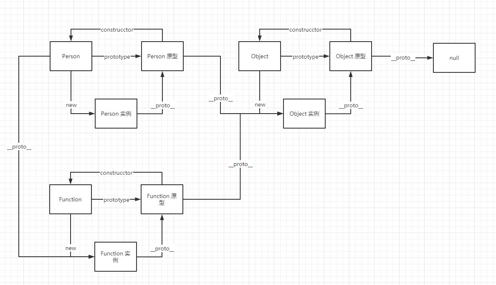

# 组合继承

```js
function Parent(name) {
    this.name = name
}

Parent.prototype.say = function() {
    console.log('Parent say', this.name);
}

function Children(name, age) {
    Parent.call(this, name)
    this.age = age
}

// 使 Children 拥有所继承元素的原型上的属性和方法
Children.prototype = new Parent('')

// 修正原型到 constructor 的正确指向
Children.prototype.constructor = Children

// 子类自己的原型方法
Children.prototype.run = function () {
    console.log('children run')
}

const c = new Children('hedashuai', 25)

c.say()
c.run()

console.log(c.__proto__ === Children.prototype);
console.log(c.constructor === Children);
```

## 组合寄生继承

上面的方式有一个缺点就是 Children 的 prototype 会 new 一次 Parent
这样会在 prototype 上加一些不必要的属性，造成内存浪费。
下方的组合寄生继承方式就可以避免这种现象

```js
function Parent(name) {
    this.name = name
}

Parent.prototype.say = function() {
    console.log('Parent say', this.name);
}

function Children(name, age) {
    Parent.call(this, name)
    this.age = age
}

// 使 Children 拥有所继承元素的原型上的属性和方法
Children.prototype = Object.create(Parent.prototype)

// 修正原型到 constructor 的正确指向
Children.prototype.constructor = Children

// 子类自己的原型方法
Children.prototype.run = function () {
    console.log('children run')
}

const c = new Children('hedashuai', 25)

c.say()
c.run()

console.log(c.__proto__ === Children.prototype);
console.log(c.constructor === Children);
```

