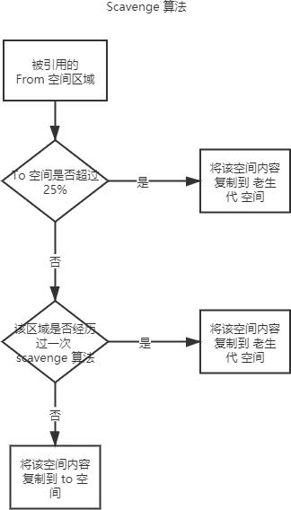

# V8 引擎的垃圾回收机制

总结的该[文章](https://juejin.cn/post/6844904016325902344#heading-5)当中的内容，以下内容仅为了方便个人记忆。

## 引擎中内存区域的划分

## 新生代空间的回收

在新生代区域中使用的 scavege 算法来垃圾回收的，首先他会对所有空间进行检查，如果变量没有被引用就会被回收，如果有被引用就会执行以下逻辑：

## 老生代空间的回收

之前的引擎有使用过 引用计数 的算法来处理，有一个引用就计数加一，如果引用数量为0就代表不被引用，清空区域即可。
但是这个算法对循环引用没有处理的办法，会造成内存无法释放。

现在的V8引擎就使用的 标记清除、标记整理算法
首先会标记内存区域中还被引用的区域，然后就引用区域的值移动到内存的另一端，最后将未被引用的区域清除释放。
